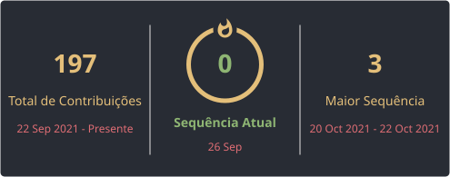
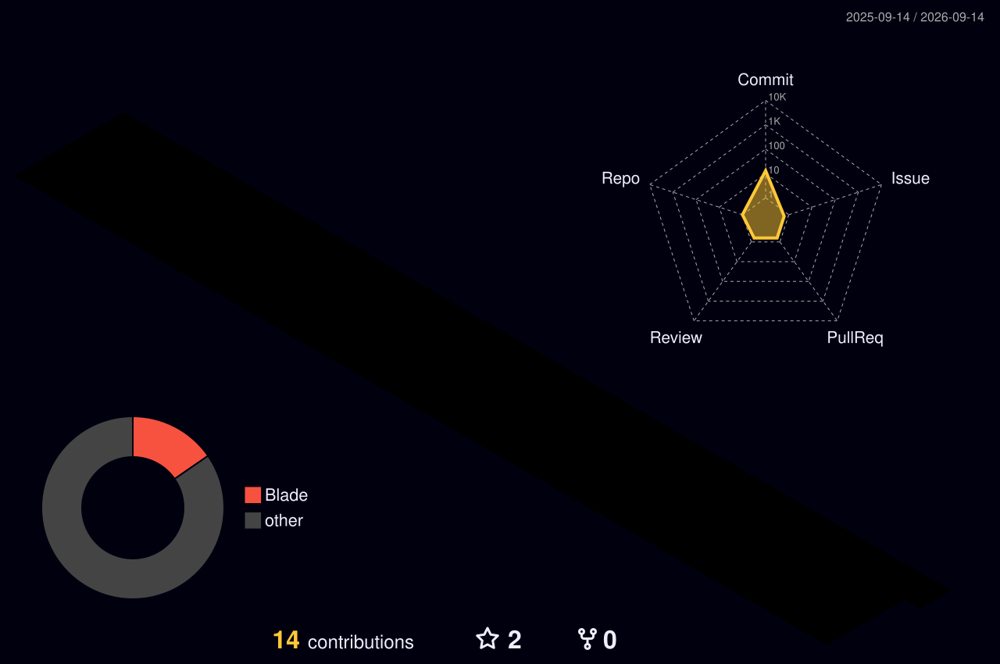

  

  

    
    
    
  

---

### Sobre

Desenvolvedor backend focado em APIs, sistemas web e integrações. Trabalho no dia a dia com **Python/Django** e também com **PHP/Laravel**, além de bancos relacionais, filas e Docker.

- Local: Brasil
- Stack principal: Python, Django, PHP, Laravel, PostgreSQL, Docker
- [LinkedIn](https://www.linkedin.com/in/johnny-almeida-b618281b9/)

---

### Stats

  
  

 

  

---

### Troféus

  

---

### Atividade

  

---

### Stack

  

